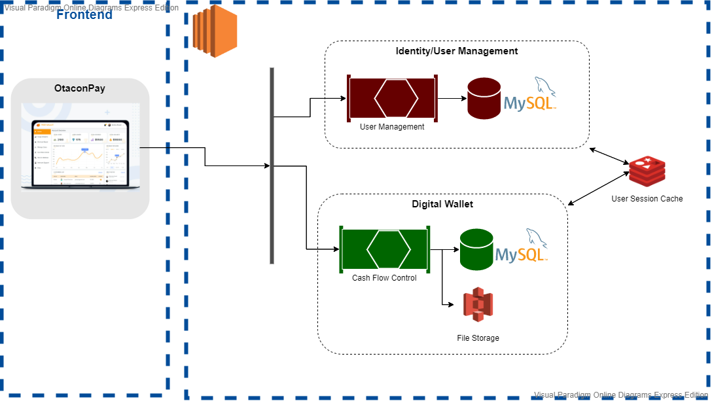

# Desafio para Solução de Arquitetura para Sistema de Carteira Digital

## Soluções à Curto Prazo (Desafio 1)

### Condições Atuais

- Banco de dados relacional MySQL 5.7
- HTTP Server TomEE
- Aparenta ser aplicação única (monolito)

### Premissas

- Melhora na performance de processamento de transações (100 TPS) para a virada do próximo mês

### Sugestões

- Atualmente o sistema está com duas responsabilidades, **Gestão de Usuários** e **Carteira Digital** (incluindo Saque e Débitos para bancos), uma solução inicial seria segregar as rotinas (escalonamento no eixo Y) e rotas destas duas responsabilidades em dois serviços diferentes, assim permitindo escalonamento independente.
  - Gestão de Usuários
    - Criar Usuário
    - Atualizar Usuário
    - Login Usuário
    - Trocar Senha
    - Dados Usuário
  - Carteira Digital
    - Saque via TED
    - Depósito TED
    - Transferir Saldo Carteira
    - Transferir Lote

[^Diag001]: Estrutura sugerida para curto prazo mantendo os módulos atuais

- TomEE permite ***load balancing*** com **nginx** e geração dinâmica de instâncias de serviços sob demanda, colocaria então inicialmente um **limite** de **5 instâncias para o serviço de gestão de usuários** e **20 para o de transações financeiras** para poder avaliar o impacto na virada do mês.
- Seria necessário também uma forma de **centralizar a gestão de sessão de usuário** aberta entre os serviços, para tanto poderia ser utilizada uma ferramenta de **cache distribuído** como o **Redis**, que tem utilização simples e poderia rodar como serviço na VM t2.medium. Seria necessário também gerar um **ID de sessão** na abertura do login e reter esse dado **localmente no browser (cookies)**.
- Seria importante também **segregar as tabelas** utilizadas por cada serviço caso isso já não esteja separado, para **não gerar disputa de acesso nas áreas de memória**. Também **indexar** as tabelas pelo **campo "documento" do usuário** para evitar ao máximo disputas entre as instâncias do mesmo serviço. Seria interessante também para fins de performance **indexar os campos de data e/ou IDs** (caso haja uma forma de organização entre eles que possa ser utilizada) de forma **decrescente** para não ser necessário iterar em dados antigos à todo momento.

## Soluções à Longo Prazo (Desafio 2)

### Condições Atuais

- Mantido atualmente por um engenheiro, sem nenhuma automação de deploy
- Logs locais apenas, em arquivo
- Sem ferramentas de *health check*
- Há versionamento com *git*, com duas *branches*, uma para cada ambiente

### Premissas

- Crescimento de 300% na base de usuários nos próximos meses
- Permite troca de ferramentas de desenvolvimento
- Permite troca de recursos do servidor IaaS
- Desejo de internacionalizar as APIs

[^Diag002]: Estrutura sugerida para longo prazo mantendo os módulos atuais

### Sugestões

- **Estrutura Voltada ao Negócio**

  - Realizar um **processo de *event storming*** com os **conhecedores do negócio** para definir os  **limites do sistema** e os **campos semânticos** de cada módulo, bem como cada problema que o sistema se propõe a resolver. Com essa base entender onde (em quais serviços) se encaixaria cada uma das funcionalidades e assim **reestruturar o que já foi desenvolvido** e demarcar o que e onde irá ser desenvolvido o que vier no ***roadmap***.
  - **Métricas Importantes**: 
    - **Rastreabilidade de Features**: Enxergar o quanto do que foi definido como necessidade no inicio do desenho está chegando até o fim do processo (entrada em produção) sem mudanças e ou adaptações de conceito.
    - **Aderência ao *Roadmap***: Saber o quanto do que foi previsto no *roadmap* da plataforma foi seguido pela equipe.

- **Arquitetura do Backend**

  - Desenvolver os microsserviços para trabalharem **orientados a eventos** com **CQRS** (Command Query Responsability Segregation) e terem as camadas de **DDD** (Domain Driven Development) ao menos nos comandos, criando assim camadas de **dominio, infraestrutura e aplicação** bem definidos, com as dependências corretas.
  - Para mensageria utilizaria o **RabbitMQ**, por trás de uma estrutura consolidada (sempre com **inversão de dependência**) de ***eventbus*** nos serviços, por ser de simples uso e não envolver muita configuração, também para evitar colocar, nesse primeiro momento, **inteligência nas filas, apenas nos serviços**. 
  - Sugeriria começar **novos serviços com .net core** por estar tendo um **investimento forte da Microsoft** recentemente e por ter muitas semelhanças com o Java, além de ter uma **grande e crescente comunidade**, ainda mais para a equipe que já está familiarizada com uma **linguagem fortemente tipada** e com boa **base em orientação a objetos**. Estudos mostram um **ganho de performance** muito alto em **aplicações .net containerizadas utilizando kestrel**.
  - **Containerizaria** todos serviços com **docker**, até mesmo para permitir o **escalonamento com kubernetes** e **isolaria toda a rede do orquestrador atrás de um gateway**, para não permitir muitas aberturas do sistema para o mundo externo.
  - Levantaria uma base dados **ElasticSearch para armazenar os dados históricos** de transações para **OLAP** e geração de ***reports***. Acessado por um **serviço Historiador** que receberia as atualizações via mensageria e faria o ***ingest*** para gravação dos dados e também acessado por mais um **serviço de criação de *reports*/PDF** e download.
  - Sugeriria utilizar **MongoDB** no lugar do MySQL para fins de **melhor escalonamento** dos dados e melhor **performance de leitura/escrita** (menor disputa de áreas de memória do repositório de dados) para **múltiplas instâncias do mesmo serviço**.

- **Arquitetura do Frontend**

  - Para o frontend web utilizaria **React com TypeScript**. React por ter uma curva de aprendizado mais suave e por trabalhar com **DOM virtual**, que permite uma **renderização do componente** sem precisar renderizar de novo toda a árvore de componentes, e TypeScript por ter uma estrutura mais **orientada a objetos e ser mais compacto**, o que facilita muito a **manutenção**.
  - Também para a estrutura da web utilizaria um padrão **SPA** (Single Page Application) por ser mais **intuitivo para o usuário final** e também utilizar **menos trafego durante o uso**, o que facilita a **segurança da plataforma**. Sem contar também que não há a necessidade de divulgação das páginas internas do app para *crawlers* de sites de busca, sendo a solução mais indicada para dados pessoais e contas de carteira digital.

- **Interfaces com Sistemas Externos**

  - Para a interface de arquivos CNAB, utilizaria uma estrutura de **cache (Redis)** antes da escrita, onde o serviço de controle da carteira **mandaria eventos** a qualquer momento para o serviço de ***ingest*** destes dados e a **cada 1 minuto** um segundo serviço pegaria esses dados e **realizaria o ETL** (Extract Transform Load) dos dados para o padrão dos arquivos **CNAB e gravaria-os no *storage* S3**.

    
    
    

  [^Diag003]: Diagrama de sequencia da interface para arquivos CNAB

  - **Métricas Importantes**: 
    - **Geração/Consumo de Arquivos CNBA por Minuto**: Visualizar se a quantidade de arquivos para consumo do sistema externo está condizente e se o sistema externo está conseguindo absorver a demanda.
    - **Quantidade de Ações de Débito/Crédito por Segundo**: Ver o fluxo de informação na saída da plataforma, bem como poder visualizar comportamentos no decorrer do mês.

- **Internacionalização**

  - Inserir a estrutura de **Globalization e Localization** no padrão **I18N** no frontend e nos serviços para mostrar mensagens e campos em outras línguas, conforme **configuração do usuário**.

- **Segurança**

  - Colocaria um **certificado de chave assimétrica** para trabalhar com **SSL/TLS**, validando diretamente no ***gateway***, evitando necessidade de gerar ***boilerplates* nos serviços internos**. O certificado ficaria armazenado no **KMS** da Amazon.
  - Utilizaria uma ferramenta de **controle de autenticação de usuário** com padrão **oAuth 2.0**, utilizando fluxo de geração de **código de autorização com chave de giro PKCE** (que não retém segredo na aplicação transpilada). Utilizaria um **autenticador/autorizador próprio** com a ferramenta **identity server 4**, que permite autenticação ***two-factor*** que facilita e deixa mais **seguro o acesso do usuário**, bem como permite utilizar uma rotina própria de ***consent***, facilitando a plataforma estar de acordo com a **LGPD**.
  - **Métricas Importantes**: 
    - **Resultados de testes de penetração/vulnerabilidade**: Indicam falhas de segurança na abordagem do sistema e no fluxo de validação por tabela, como permissão de *injection* de algum dado em algum campo, ou alguma porta aberta que não deveria estar, ou até dados sensíveis em locais que não deveria.

- **Deploy e Infraestrutura** 

  - Inserir um serviço de **automação de deploy** com base nos ***commits***. Migraria os repositórios para uma **estrutura baseada na estrutura e módulos do produto** e já aproveitaria para migrar para o **GitLab**, que já tem um ecossistema pronto para montagem de ***pipelines* de ci/cd (GitLab-CI)**. 
  - Utilizaria ***branches*** para cada ambiente, já **ligado com o ci/cd para *deploy***, adicionando o **ambiente de *quality*** para validação da **equipe de testes e dos POs**. 
  - Também adicionaria o conceito de ***green blue*** para ***hot swap*** do **ambiente de produção** e retorno rápido em caso de algum problema em produção. Ficando assim então com quatro ambientes, ***development*, *quality*, *staging* e *production***, os últimos dois diretamente ligados ao *green blue*.
  - Faria **automação das validações de qualidade de código**, **compilação/geração de containers docker**, ***update* para o *registry* e atualização dos scripts** de infraestrutura do kubernetes (estes segregados por repositório).
  - Colocaria jobs, permitindo start manual também, de **validação** de qualidade de **interface visual** com **Selenium**.
  - Serviço de ***botchat*** na plataforma de troca de mensagens no grupo da equipe técnica, para **disparar algum *job*** ou **repassar validações de *code review*** entre os desenvolvedores.
  - **Centralizaria as configurações** de ambiente em uma ferramenta **Key Value**, **Consul** tem uma estrutura bem simples e com interface amigável.
  - **Métricas Importantes**: 
    - **Commits por Hora**: Enxergar a quantidade de commits que estão sendo feitos ajuda a entender se é necessário mais runners para processar os pipelines. 
    - **Processamento/Memória dos Runners**: Para entender se não tem nenhum processamento de pipeline engargalando outros e também se as máquinas dimensionadas para o runners são adequadas pra demanda. 
    - **Processamento/Memória dos Pods**: Ver se não tem nenhum pod processando o que não deveria, até mesmo por que se a memória/cpu passa um limite o kubernetes derruba o pod e pode ficar gerando instâncias falhas sem necessidade.
    - **% de Pods Failed vs Running**: Se há pods falhos, há algum erro ocorrendo e/ou estouro de memória/cpu que deve ser investigado.
    - **Time to Deploy**: Tempo entre o commit e a feature chegar no servidor, importante por indicar se o processo de ci/cd está performando corretamente.
    - **Disponibilidade dos Servidores**:  Entender se os servidores estão disponíveis o tempo necessário para atender as necessidades do cliente.
    - **MTTR (Mean Time to Recovery)**: Importante para saber se os problemas de infraestrutura estão sendo resolvidos no tempo necessário. 

- **Qualidade de Software**

  - Poderia enviar os **retornos das compilações** no pipeline para o **SonarQube** para ter um local **centralizado para avaliação de qualidade de código** da plataforma, também a ferramenta permite criar ***quality gates*** para **evitar** que determinados ***code smells*** ou más práticas avancem no *deploy*, bem como garantir o ***test coverage***. 
  - Reforçaria com a equipe de desenvolvimento o uso do **TDD** (Test Driven Development), criando sempre **testes de unidade e de integração** **antes do código** propriamente dito, o que ajuda a focar a equipe a **solucionar** o problema proposto de forma direta e modular.
  - Faria uma estrutura de ***code review*** interno da própria equipe de desenvolvimento, onde permitiria desenvolvedores até de camadas diferentes validar e **revisar códigos** para não só ajudar na **detecção de possíveis bugs**, como também **aprender sobre tecnologias**.
  - Daria **autonomia** para a equipe de testes iniciar jobs de **validação de qualidade de interface visual** e organizaria o fluxo para **testes exploratórios** de tempos em tempos, além dos **testes focados nos fluxos desenvolvidos**.
  - **GitLab** fornece uma ferramenta de ***bug track*** que também ajudaria no fluxo.
  - **Métricas Importantes**: 
    - **Qualidade Geral do Código**: % de possíveis *code smells* e más práticas que podem ser pegas de forma automática pela ferramenta.
    - ***Test Coverage***: Entender o quando do sistema está coberto por testes, nunca se terá um indicador 100%, até mesmo pois tem parte do código que não tem como ser testadas, mas quanto maior melhor.
    - **Entrada/Saída de Bugs Diário**: Entender se estamos com capacidade de consumir os bugs no mínimo na medida que entram.

- **Saúde da Plataforma**

  - Como estamos trabalhando com microsserviços, também é importante haver uma **ferramenta de logs** padrão **em cada serviço** bem como uma **centralização de logs**, o **serilog** é um serviço que trabalha com o *design pattern* de ***sink* de logs**, o que permite jogar os logs do serviço tanto para o console, onde o dashboard do kubernetes consegue pegar e mostrar como para um **centralizador remoto**, como o **graylog**, que tem uma interface amigável, tem versão gratuita e muito leve, além de **trabalhar com ElasticSearch**.  
  
  - Outro fator importante para verificação da **saúde dos serviços** e ferramentas é a adição de **rotas de *healthchecks*** em todos serviços, para validar não apenas se o **serviço está rodando**, mas também se todos **acessos às ferramentas pelo serviço estão OK**. O próprio kubernetes tem já uma validação de saúde que vai até a camada do pod, mas pode ir mais adentro do serviço e coletar mais informações se necessário e configurado para tanto.
  
  - **Métricas Importantes**: 
  
    - **Overall Health Check**: Visualizar a saúde geral, para mitigação mais rápida de causas de problemas gerais da plataforma.
    - **Logs de Erro por Segundo**: Serve de termômetro para algum eminente futuro problema, permite em alguns casos atuar antes que vire algo maior.
  
    

### Outros Questionamentos

- Há a necessidade de rodar o sistema em mobile? Qual o seu interesse nisso nos próximos meses? *(Seria necessário um estudo para adicionar uma linguagem nova com a equipe técnica, provavelmente Flutter. Também criar contas nas plataformas mobile e novos fluxos de testes e automações.)*
- Há interesse de acrescentar novos módulos e funcionalidades? Ou por enquanto ficamos na gestão de usuários e carteira digital? *(Seriam criados novos serviços e telas no SPA)*
- Quanto a internacionalização, há interesse em fazer conversão de moeda? *(Precisaria de serviços dedicados para isso e provavelmente novas interfaces externas)*

